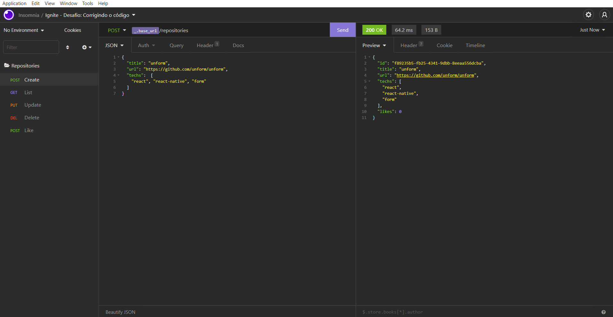

<h1 align="center">
  
</h1>

<h3 align="center">
  Desafio: Corrigindo o código
</h3>

<p align="center">Essa aplicação realiza o CRUD (Create, Read, Update, Delete) de repositórios de projetos utilizando o Node.js</p>

<p align="center">
  <a href="#como-executar-o-projeto">Como executar o projeto</a>&nbsp;&nbsp;&nbsp;|&nbsp;&nbsp;&nbsp;
  <a href="#sobre-o-desafio">Sobre o Desafio</a>
</p>

<p align="center">Back-end</p>

<p align="center">
  
</p>

## Como executar o projeto

### Clonar este repositório

```bash
git clone https://github.com/eliasmcastro/rocketseat-ignite-nodejs-desafio-corrigindo-o-codigo.git
```

### Requisitos

- [Node.js](https://nodejs.org)
- [Yarn](https://yarnpkg.com)

#### Opcional

- [Insomnia](https://insomnia.rest)

### Passos para a execução

**1. Executar aplicação**

Instalar as dependências do projeto

```bash
yarn
```

Iniciar o servidor de desenvolvimento

```bash
yarn dev
```

A aplicação começará a ser executada em http://localhost:3333

_Dica: utilizar o Insomnia para testar as rotas_

- Abrir o Insomnia -> Application -> Preferences -> Data -> Import Data -> From File -> Selecionar o arquivo insomnia.json

### Testes automatizados

Para começar a utilizar os testes, execute o comando `yarn test`, e ele irá te retornar o resultado dos testes

_Dica: se utilizar o comando `yarn test --watchAll`, o mesmo fica realizando automaticamente os testes toda vez que o arquivo app.js é alterado_

## Sobre o desafio

A estrutura de um repositório ao ser criado é a seguinte:

```jsx
{
  id: uuid(),
  title,
  url,
  techs,
  likes: 0
}
```

Descrição de cada propriedade:

- **id** deve ser um uuid válido;
- **title** é o título do repositório (por exemplo "unform");
- **url** é a URL que aponta para o repositório (por exemplo "[https://github.com/unform/unform](https://github.com/unform/unform)");
- **techs** é um array onde cada elemento deve ser uma string com o nome de uma tecnologia relacionada ao repositório (por exemplo: ["react", "react-native", "form"]);
- **likes** é a quantidade de likes que o repositório recebeu (e que vai ser incrementada de 1 em 1 a cada chamada na rota de likes).

### Rotas da aplicação

#### GET `/repositories`

A rota deve retornar uma lista contendo todos os repositórios cadastrados.

#### POST `/repositories`

A rota deve receber `title`, `url` e `techs` pelo corpo da requisição e retornar um objeto com as informações do repositório criado e um status `201`.

#### PUT `/repositories/:id`

A rota deve receber `title`, `url` e `techs` pelo corpo da requisição e o `id` do repositório que deve ser atualizado pelo parâmetro da rota. Deve alterar apenas as informações recebidas pelo corpo da requisição e retornar esse repositório atualizado.

#### DELETE `/repositories/:id`

A rota deve receber, pelo parâmetro da rota, o `id` do repositório que deve ser excluído e retornar um status `204` após a exclusão.

#### POST `/repositories/:id/like`

A rota deve receber, pelo parâmetro da rota, o `id` do repositório que deve receber o like e retornar o repositório com a quantidade de likes atualizada.

### Específicação dos testes

#### Testes de repositórios

- **Should be able to create a new repository**

Para que esse teste passe, você deve permitir que um novo repositório seja cadastrado pela rota **POST** `/repositories`.

Também é necessário que você retorne a resposta com o código `201`.

- **Should be able to list the projects**

Para que esse teste passe, é necessário que você conclua o teste anterior. Se tudo ocorreu bem, os repositórios cadastrados deverão aparecerem na listagem da rota **GET** `/repositories` e esse teste irá passar.

- **Should be able to update repository**

Para que esse teste passe, você deve permitir que um repositório seja atualizado a partir de seu `id` pela rota **PUT** `/repositories/:id` usando as informações recebidas pelo corpo da requisição.

- **Should not be able to update a non existing repository**

Para que esse teste passe, você deve verificar se o repositório existe antes de atualizar as informações na rota **PUT** `/repositories/:id`. Caso não exista, retorne um status `404` (que é o status para **Not Found**) com uma mensagem de erro no formato `{ error: "Mensagem do erro" }`.

- **Should not be able to update repository likes manually**

Para que esse teste passe, você deve impedir que a quantidade de likes de um repositório seja alterada manualmente através da rota **PUT** `/repositories/:id`.
Por exemplo:

**Errado:**

```jsx
// Repositório recém criado:
{
	id: "c160a99b-9d3b-4669-8a35-8dce1e8196ec",
	title: "Umbriel",
	techs: ["React", "ReactNative", "TypeScript", "ContextApi"],
	url: "https://github.com/Rocketseat/umbriel",
	likes: 0
}

// Requisição para alterar informações: 
// Rota: "/repositories/c160a99b-9d3b-4669-8a35-8dce1e8196ec"
// Método: PUT
// Corpo: { title: "Novo título", likes: 10 }

// Retorno:

{
	id: "c160a99b-9d3b-4669-8a35-8dce1e8196ec",
	title: "Novo título",
	techs: ["React", "ReactNative", "TypeScript", "ContextApi"],
	url: "https://github.com/Rocketseat/umbriel",
	likes: 10
}
```

**Certo:**

```jsx
// Repositório recém criado:
{
	id: "c160a99b-9d3b-4669-8a35-8dce1e8196ec",
	title: "Umbriel",
	techs: ["React", "ReactNative", "TypeScript", "ContextApi"],
	url: "https://github.com/Rocketseat/umbriel",
	likes: 0
}

// Requisição para alterar informações: 
// Rota: "/repositories/c160a99b-9d3b-4669-8a35-8dce1e8196ec"
// Método: PUT
// Corpo: { title: "Novo título", likes: 10 }

// Retorno:

{
	id: "c160a99b-9d3b-4669-8a35-8dce1e8196ec",
	title: "Novo título",
	techs: ["React", "ReactNative", "TypeScript", "ContextApi"],
	url: "https://github.com/Rocketseat/umbriel",
	likes: 0 // A quantidade de likes não mudou
}
```

- **Should be able to delete the repository**

Para que esse teste passe, você deve permitir que um repositório seja excluído através do `id` passado pela rota **DELETE** `/repositories/:id`.

- **Should not be able to delete a non existing repository**

Para que esse teste passe, você deve validar se o repositório existe antes de excluí-lo. Caso o repositório não exista, retorne um status `404` com uma mensagem de erro no formato `{ error: "Mensagem do erro" }`.

### Testes de likes

- **Should be able to give a like to the repository**

Para que esse teste passe, deve ser possível incrementar a quantidade de likes em `1` a cada chamada na rota **POST** `/repositories/:id/like`. Use o `id` passado por parâmetro na rota para realizar essa ação.

- **Should not be able to give a like to a non existing repository**

Para que esse teste passe, você deve validar que um repositório existe antes de incrementar a quantidade de likes. Caso não exista, retorne um status `404` com uma mensagem de erro no formato `{ error: "Mensagem do erro" }`.